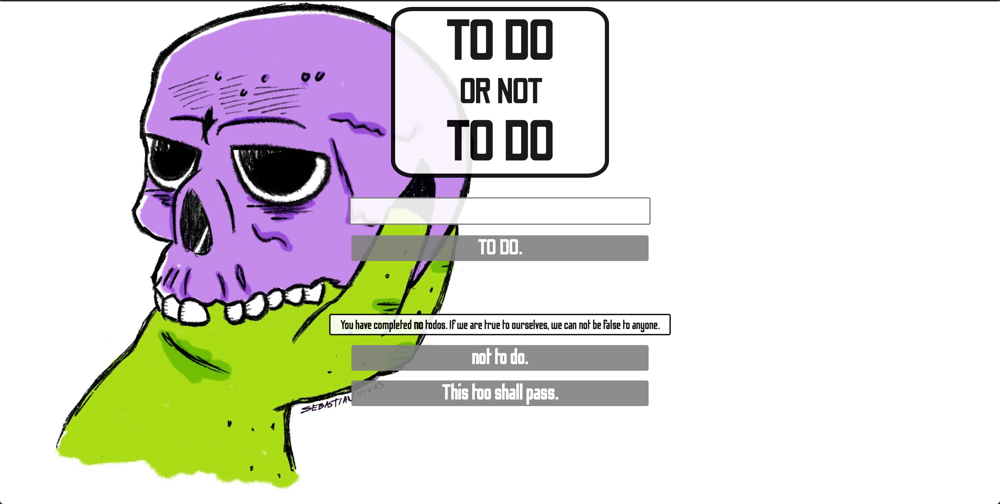

# To Do List
#### Project Scope: Design functional inBrowser To Do List. The user inputs desired task into form and submits with the "to do" button. The tasks will become list items appended to the ul tag in the HTML.

# How it was made:
#### HTML5, CSS3, Javascript E6

# Optimizations
#### A strike through can be applied to a task upon click event. Strike through list items can be removed with the press of "not to do" button. The entire list can be cleared with the "This too shall pass" button.  

# Lesson Learned: 
#### .appendChild() and .createElement() were vital to the functionality of this project. They created the new li element and attatched them to the ul, making them appear live in the browser. The property, .innerHTML, was necessary to target the li's with strikethroughs to be able to remove them with the .removeChild() method. 
